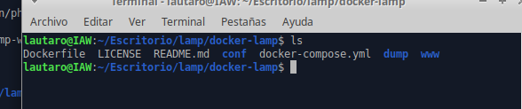
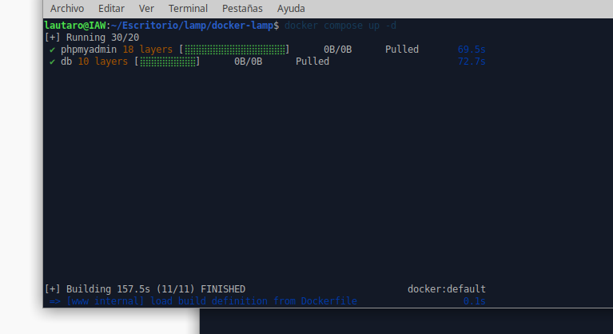
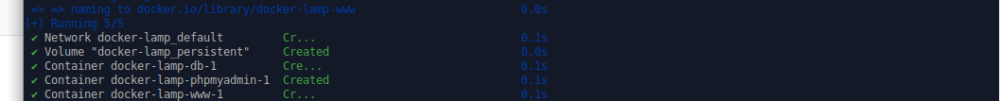
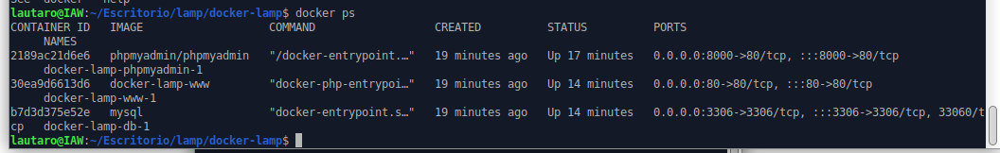
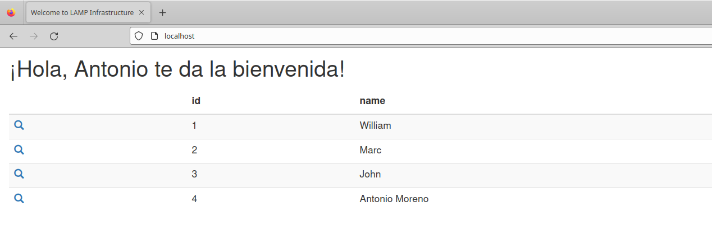
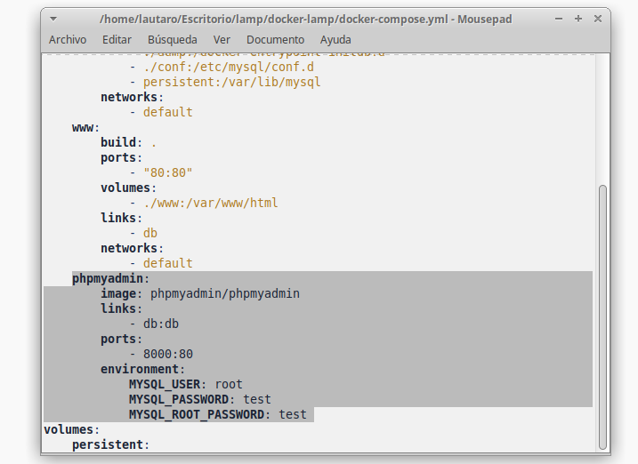
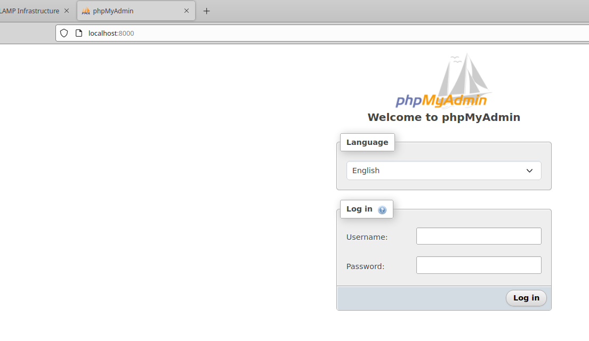
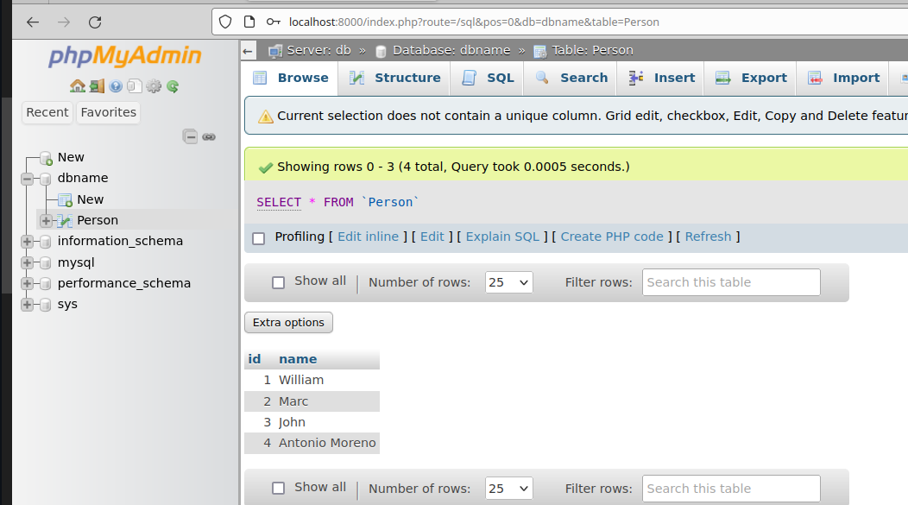

# 
 *Pila de LAMP con docker compose* 

+  Primero debemos clonar desde github el repositorio con todos los archivos necesarios para el docker realizar el docker compose:

          git clone https://github.com/jersonmartinez/docker-lamp.git

Y vemos que se clono perfectamente:

En esta carpeta tenemos el dockerfile y el docker-compose que son los archivos necesarios para construir la imagen y crear los contenedores.

+ Ya con la carpeta clonada lo que necesitamos es ejecutar el siguiente comando para crear todos los contenedores necesarios en base al docker compose.
Este comando se utiliza para iniciar los servicios definidos en el archivo docker-compose.yml, donde se especifican los servicios y volumenes que van a hacer funcionar la pila de LAMP

        
        docker compose up -d

Vemos que se ejecuta y empieza a descargar y construir:

Ya con la instalacion terminada vemos con un check verde que se creo la red, el volumen, la base de datos, el phpmyadmin y el apache con su web.

+ Una vez creado todo lo que hacemos es una comprovación de que todo esta creado y funcionando haciendo un docker ps donde tenemos los 3 contenedores con los servicios.

        docker ps

Con la informaciónd e este comando podemos obtener los puertos en los que estan escuchando cada servicio por lo que ya podemos empezar a hacer comprovaciones de que todo esta funcionando correctamente.

Ingresando a localhost vemos que tenemos el servicio apache funcionando y la web nos muestra la informacion de la base de datos que esta conectada con su html.

Ahora para comprovar que el phpmyadmin esta funcionando entramos a localhost pero con el puerto 8000, y ahí encontramos es la herramienta para administrar nuestra base de datos.
Nos podemos logear con el usuario root y la contraseña test, esta informacion la sacamos del fichero docker-compose.yml

Entramos a la base de datos y vemos los datos que vimos antes en la web:

Una vez que  que pudimos ver la base de datos desde el phpmyadmin tambien hacemos la comprovaciond e que el servicio de la base de datos esta funcionando ya que sino no tendriamos entrada a este desde este administrador.
