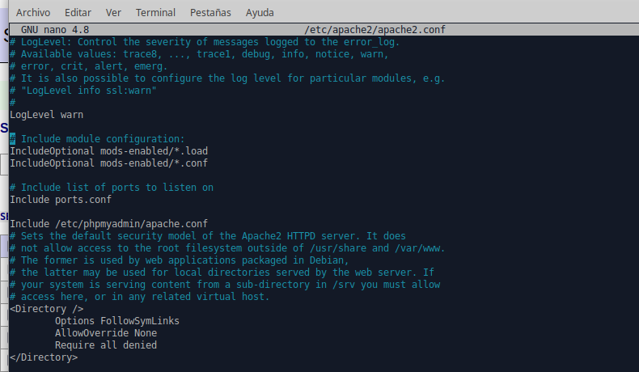
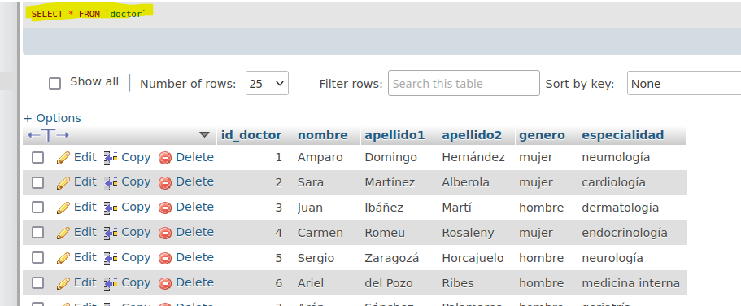
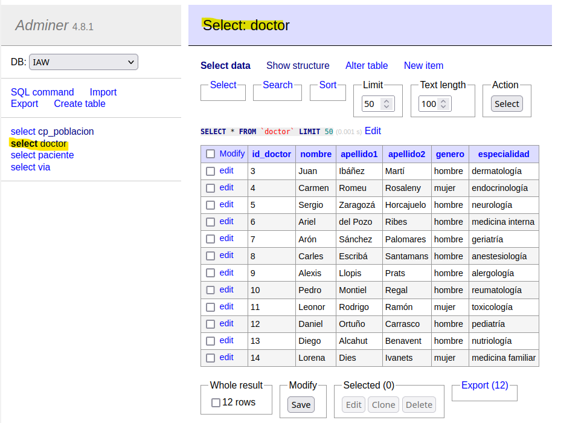

# 
 <u> Tarea 1 - LAMP en Ubuntu</u> 

---

## 1. *Servidor Web Apache*

+ Instala el servidor Web Apache, configúralo y prueba que funciona correctamente

Empezamos instalando el servidor apache y verificando que funciona.

    sudo apt install apache2

---
---

## * 2. MySql *

+ Instala el servidor MySql y configúralo

Lo instalamos con el comando:

    sudo apt install mysql-server 

+ Debes poder (por consola) acceder al servidor de base de datos, crear una base de datos de
prueba con una tabla e insertar unos cuantos registros. Realiza una consulta para comprobar que
se han insertado los registros.

Como vemos tenemos el servicion corriendo.

En esta captura vemos que podemos ingresar ya con un usuario que había creado antes mientras hice toda la tarea.

Vemos que ya hemos creado la base de datos IAW y la utilizamos.

Y podemos crear tablas, al final vemos que ya hemos creado las tablas cp_poblacion, doctor y paciente que es la recien creada.

---
---

## * 3. Php *

+ Instal la última versión de PHP en tu máquina y muestra que está funcionando mostrando la
información de PHP en una página web alojada en tu servicio web Apache.

Instalamos php con el siguiente comando:

    sudo apt install php libapache2-mod-php php-mysql

Lo que hicimos fue en la ruta /var/www/html que es donde el apache, creamos el fichero info.php y le dimos contenido, comprovamos que todo sale bien viendo al pagina web de php.

Contenido del fichero.

+ Bola extra! Basándote en la siguiente plantilla, realiza las modificaciones necesaria para
establecer una conexión a tu base de datos, recuperar algun dato/s y mostrarlo en una página
web que alojarás en tu servidor Apache.

En base a la plantilla del profesor editamos los campos necesarios de nuestro usuario, contraseña, base de datos y necesitamos cambiar el servidor de localhost a 127.0.0.1 para que funcione.
Tambien debemos cambiar la consulta del select en base a nuestra base de datos.

Vemos que la devolución de la web concuerda con el select en mysql.

---
---

## * 4. Gestor web de Base de datos *

+ Instala un gestor de base de datos como PhpMyAdmin o Adminer (los dos si tienes suficiente tiempo) y establece conexión con tu base de datos.

Instalamos el gestor phpmy admin.

        sudo apt install phpmyadmin php-mbstring php-zip php-gd php-json php-curl

Luego tuvimos conflictos al intentar entrar a travez de la web ya que nos faltaba en la configuracion inicial una linea en el fichero /etc/apache2/apache.conf, tuvimos que añadirle el fichero de phpmyadmin para que funcione.
Añadimos la linea:

    Include /etc/phpmyadmin/apache.conf

Con este cambio ya podemos entrar a travez de la web y logearnos.

+ Realiza alguna consulta así como modificación de la estructura de la base de datos (creación de
columnas, modificación de tabla...) y de los datos (inserción, modificación...) utilizando el gestor
de base de datos instalado.

Vemos que dentro del gestor nos salen las base de datos y ya con ver que vemos las tablas y los campos sabemos que tenemos permisos de selcts

Tamabien probamos borrar una insercion con un delete.

Ahora para instalar addminer lo que tuvimos que hacer es descargarlo y lo movimos desde descargas a la carpeta de /var/www/html y ya con esto podemos ingresar.

Vemos que podemos hacer selects.

Y tambien editar la base de datos

Lo que pudimos ver es que editamos la base de datos desde los 2 gestores y desde la terminal y nunca surgió un conflicto por lo que cada modificación que hacemos en un gestor se aplica directamente en el otro.

##  * 5. Analizar los logs de Apache * 

- Instalar un analizador de logs de Apache como GoAccess y visualizar en una página web en tiempo real la monitorización del servicio web Apache instalado.

Vemos en el terminal donde podemos elegir el formato de salida del registro, elegimos la opción CLF (tercera opción).

Ya dentro podemos ver todas las opciones y informacion del apache que tenemos.

