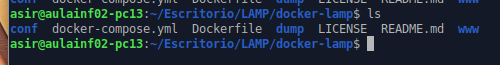
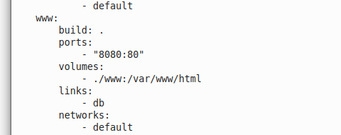
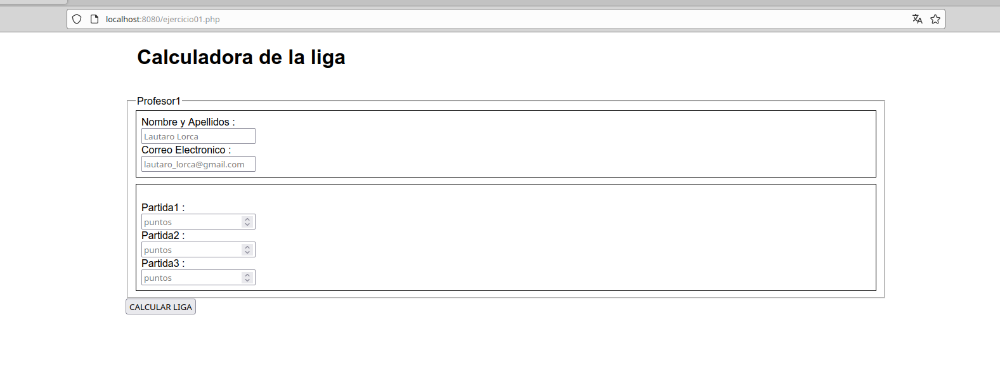

# 
 *Examen IAW* 

## Docker

Lo que hice para poder utilizar el apache en docker fue un docker compose que busque internet porque tenia la facilidad de utilizarlo con una carpeta que podia utilizar desde mi maquina.
El proceso de creacion fue el siguiente:
Debemos clonar desde github el siguiente repositorio:

    git clone https://github.com/jersonmartinez/docker-lamp.git

Lo siguiente que hacemos es cambiar el puerto del apache y crear una carpeta con un volumen para trabajar desde afuera:
 

Y luego creamos todo :

    docker compose up -d

Ahora comprovamos que este funcionando ingresando a localhost y el puerto que indicamos, vamos a comprobar que funciona ya abriendo un archivo nuevo de los que estamos haciendo:

