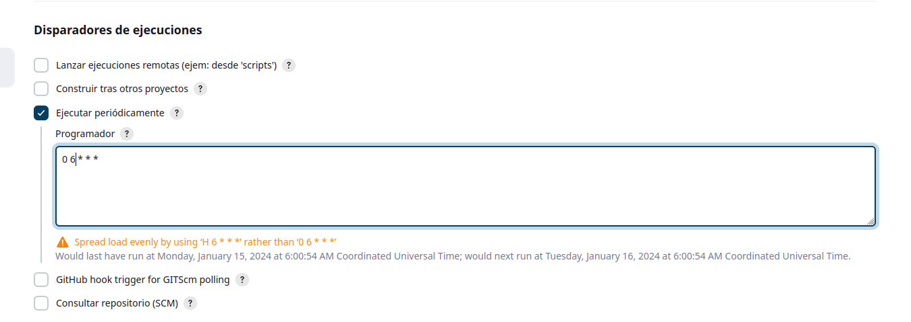
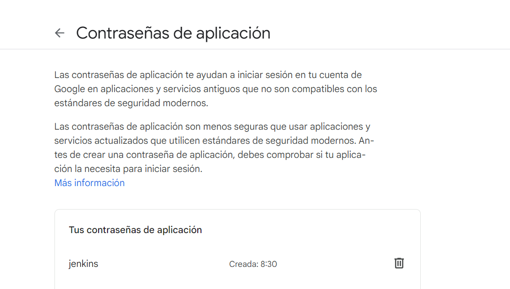
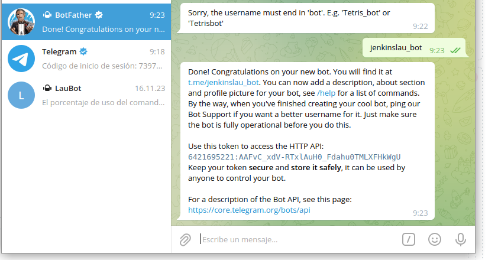

# Tarea 1: Job básico

### Crear un job de Jenkins que se ejecute periódicamente (una vez al día) con las siguientes características:

- Debe rastrear los usuarios del sistema en el que está instalada la instancia de Jenkins.

- En caso de detectar que se han creado nuevos usuarios (id>1005)  se debe notificar al administrador del sistema con un correo electrónico.

Bola extra:

- Obtener la lista de ordenadores conectados a la red interna y ejecutar el script de detección de usuarios en todos los ordenadores de la red.

Creamos el contenedor docker de jenkins con un respectivo volumen para poder ver los usuarios reales de la maquina en la que se encuentra:

    lautaro@IAW:~$ docker run -v /etc:/etc/etc --name jenkins -p 8080:8080 -p 50000:50000 41e27c2a574b

Queremos que se ejecute periodicamente todos los días:

Creamos el script para ver si existe un usuario:

    #!/bin/bash
    cat /etc/passwd | cut -d ':' -f1,3 > usuarios.txt

    while IFS=: read -r nombre_usuario uid; do
        if [ "$uid" -gt 1005 ]; then
            echo "El usuario $nombre_usuario tiene un id de $uid"
            exit 1
        else        
            exit 0
        fi
    done < usuarios.txt

Y activamos que si surge algun error no los notifique por correo:

Ahora vamos a la cuenta de gmail y creamos un token:

Y creamos la credencial en jenkins:

Una vez creado lo ejecutamos y vemos que no existe ninguno mas grande ya que fue SUCCESS:

Luego creamos un usuario mayor al 1005 y vemos al ejecutar que falla y quiere enviar el mail:

Como vemos al encontrar el error quiere mandar el mail pero nos encontramos con el siguiente error:

    MailConnectException message: Couldn't connect to host, port: smtp.googlemail.com, 465; timeout 60000

# Como no logramos hacerlo creamos un bot de telegram para encontrar solucionarlo de otra forma.

Primero fuimos al BotFather y creamos un nuevo bot:

Añadimos un pluggin llamado PostBuildScript y en el job que estamos trabajando añadimos una acción para despues de ejecutar en la que ponemos el siguiente comando para enlazarlo con el bot de telegram:

    curl -X POST -H "Content-Type: application/json" -d "{\"chat_id\": \"5419757145\", \"text\": \"Falló la tarea $JOB_NAME!! $BUILD_NUMBER,  \", \"disable_notification\": false}" https://api.telegram.org/bot6421695221:AAFvC_xdV-RTxlAuH0_Fdahu0TMLXFHkWgU/sendMessage

Para conseguir el token es el que nos da el BotFather al crearlo y el id se lo pedimos al siguiente bot:

[Texto alternativo](jenkins.imgs/12.png)

Y vemos en el chat de telegram que llegan los errores:

