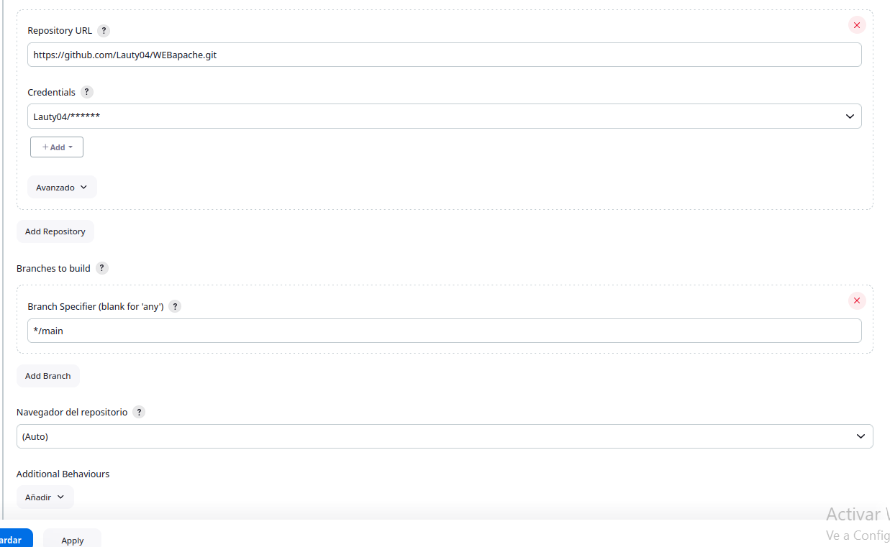
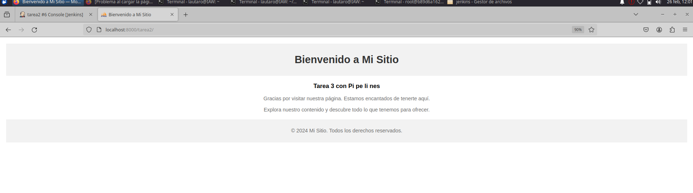

# Tarea 2: Freestyle job - despliegue web/git

Crear un job de Jenkins que descargue el código de un proyecto web alojado en tu repositorio de github.

Debemos crear las 2 maquinas con un volumen compartido hacia la maquina local en la que cada vez que se ddescargue de git el repo se comparta automaticamente con el volumen entre las maquinas:

    docker run -v /home/lautaro/WEB:/var/www/html/ -v /etc:/etc/etc --name dockerweb -p 8000:80 apache2

    sudo docker run --network jenkins-network -v /home/lautaro/WEB:/var/www/git -v /home/jenkins:/var/jenkins_home/ --name jenkins -p 8080:8080 -p 50000:50000 -p 2222:22 41e27c2a574b

Debemos crear una nueva tarea:

En la que descargamos de github con el jenkinsfile en el que el pipleni esta encargado de mover la carpeta con la web al volumen para no crear el volumen al workspace y que sobrecargue de tareas el volumen.

    pipeline {
        agent any

        stages {
            stage('mover archivo') {
                steps {
                    sh 'cp -r /var/jenkins_home/workspace/tarea2 /var/www/git/'
                }
            }
        }
    }

Con esto vemos que la tarea se ejecute correctamente y entramos por el navegador a nuestro contenedor al que enviamos la web y tenemos la web desplegada.

