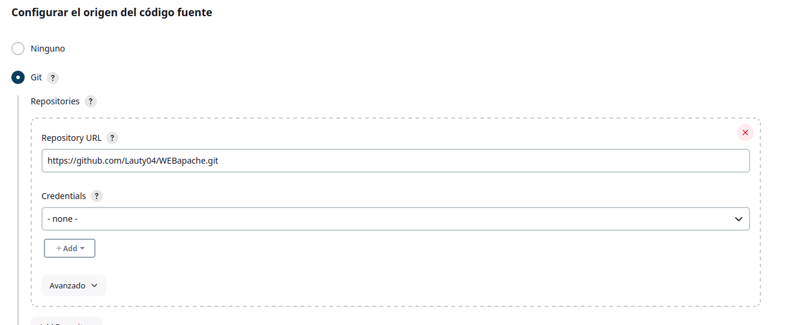
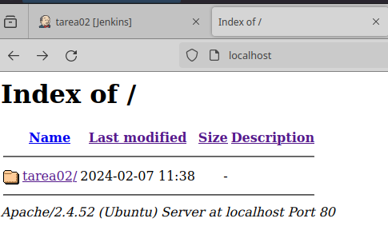
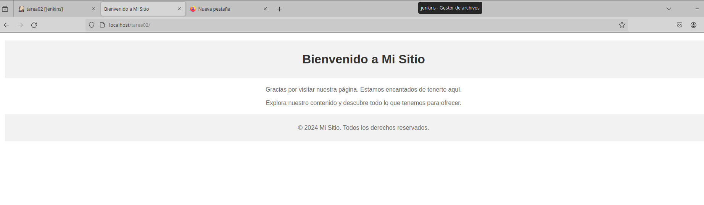

# Tarea 2: Freestyle job - despliegue web/git

Crear un job de Jenkins que descargue el código de un proyecto web alojado en tu repositorio de github.

Debemos crear una nueva tarea y uasr git para descargar el repositorio:

Luego debemos crear los contenedores con los siguientes volumenes:

Jenkins necesita un volumen para guardar el repositorio que descargamos que se guarda en  el workspace y el segundo volumen es para tener una persistencia de docker:

    docker run -v /home/lautaro/WEB:/var/jenkins_home/workspace/ -v /home/jenkins:/var/jenkins_home/ --name jenkins -p 8080:8080 -p 50000:50000 -p 2222:22 41e27c2a574b

Y para el docker apache creamos un volumen para que al ejecutar la tarea de git con el volumen o comun que tienen, automaticamente tenga la nueva web que descargamos disponible en su web

    docker run -v /home/lautaro/WEB:/usr/local/apache2/htdocs -v /etc:/etc/etc --name mi-apache -p 8888:80 httpd:latest

Como vemos ingresamos a localhost y tenemos la carpeta de la ultima descarga del job y ingresamos a l pagina desde ahí.

