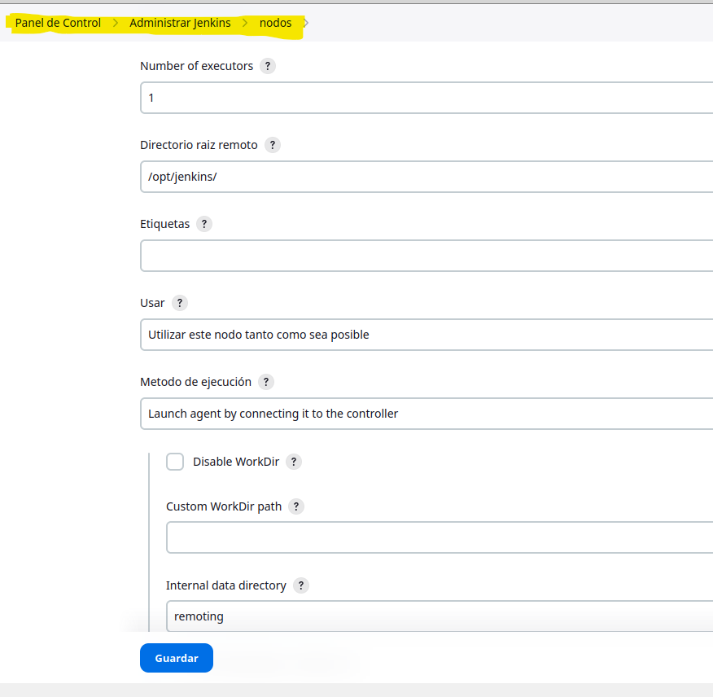
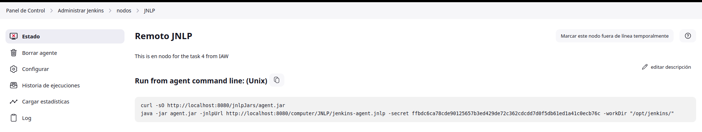
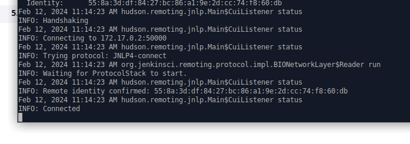
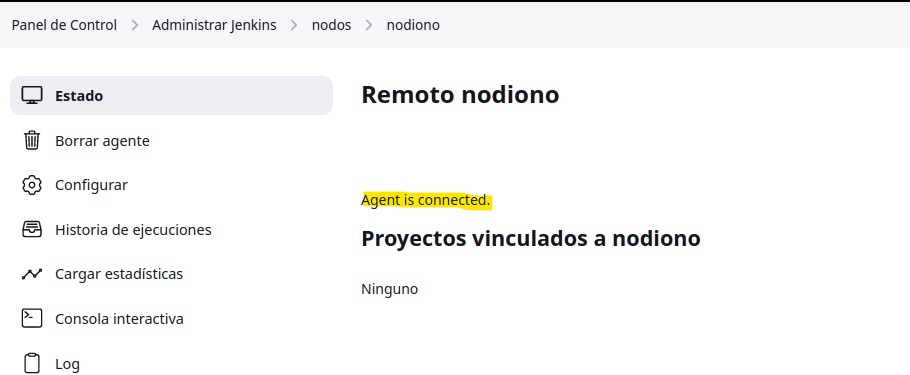
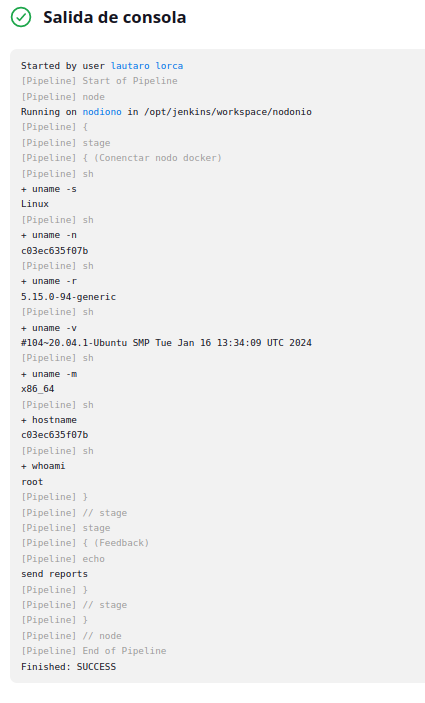
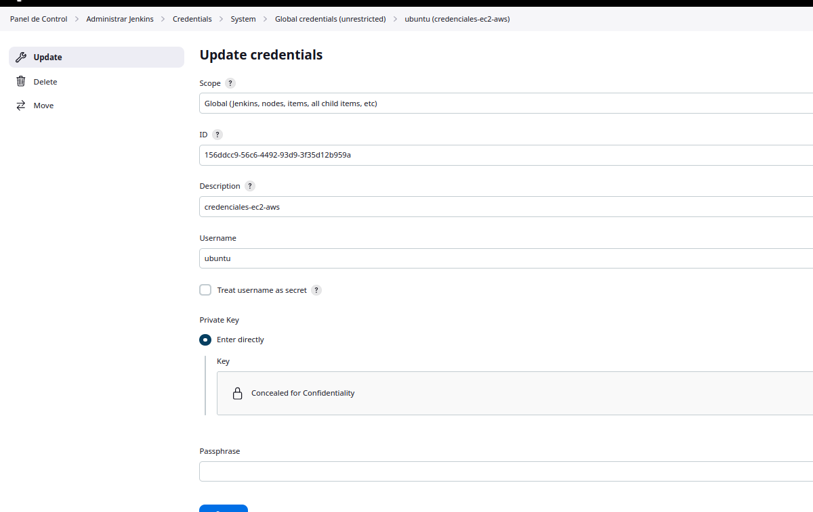
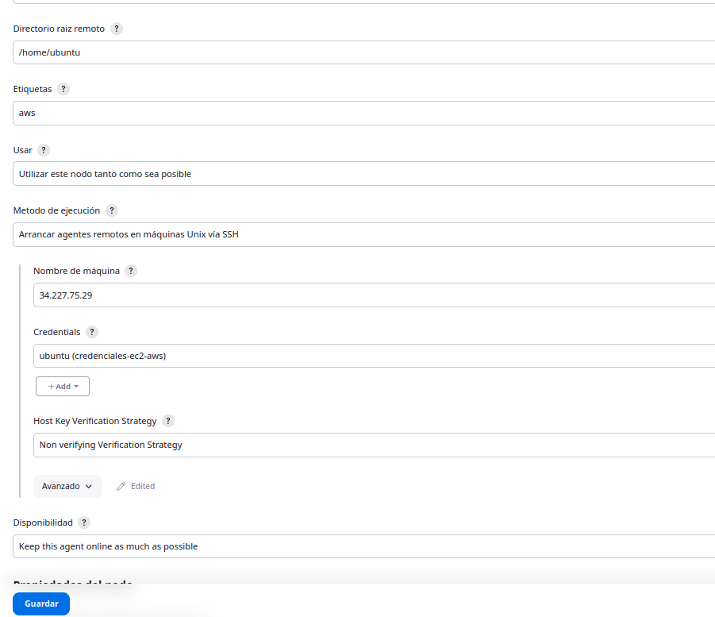
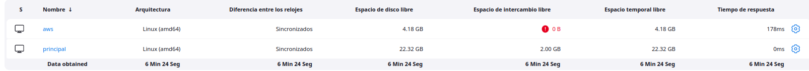
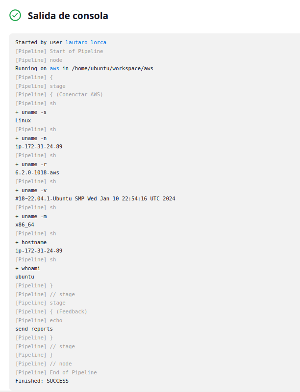

# Tarea 4: Creación de nodos (agents)

## Tarea de creación de nodos.

## Nodo conectado via Java Web Start (JNLP) (Agent.jar)

Como primer paso debemos crear el nuevo nodo desde Jenkins de la siguiente manera:

Una vez creado ingresamos al nodo y nos da los comandos para conectar el nodo:

Ahora en la maquina deberemos instalar curl y java:

    apt install curl
    apt install default-jre 

Y ejecutamos los comandos del nodo:

    curl -sO http://172.17.0.2:8080/jnlpJars/agent.jar
    java -jar agent.jar -jnlpUrl http://172.17.0.2:8080/computer/nodiono/jenkins-agent.jnlp -secret 7e3d883d46b942e6f2801ef81a16436339d716d559b9696a0c0df9f6b295e2b3 -workDir "/opt/jenkins"

Creamos un pipeline para comprovar que se ejecuta bien:

       pipeline {
            agent {
                node {
                    label 'nodiono'
                }
            }
            stages {
                stage('Conenctar nodo docker') {
                    steps {
                        sh 'uname -s';
                        sh 'uname -n';
                        sh 'uname -r';
                        sh 'uname -v';
                        sh 'uname -m';
                        sh 'hostname';
                        sh 'whoami';
                    }
                }
                stage('Feedback') {
                    steps {
                        echo 'send reports'
                    }
                }
            }
        }

Y vemos que se ejecuta correctamente:

---
---
##  Nodo en máquina EC2 de AWS (SSH)

Primero debemos configurar una credencial nueva de aws:

Luego vamos a nodos y creamos uno nuevo:

Vemos que esta funcionando:

Ahora para comprobar que se ejecuta correctamente creamos una nueva tarea con un pipline que hace comprovaciones para ver que se ejecuta en la maquina de aws:

    pipeline {
        agent {
            node {
                label 'aws'
            }
        }
        stages {
            stage('Conenctar AWS') {
                steps {
                    sh 'uname -s';
                    sh 'uname -n';
                    sh 'uname -r';
                    sh 'uname -v';
                    sh 'uname -m';
                    sh 'hostname';
                    sh 'whoami';
                }
            }
            stage('Feedback') {
                steps {
                    echo 'send reports'
                }
            }
        }
    }

Lo ejecutamos y vemos el la salida que es lo que esperabamos:

