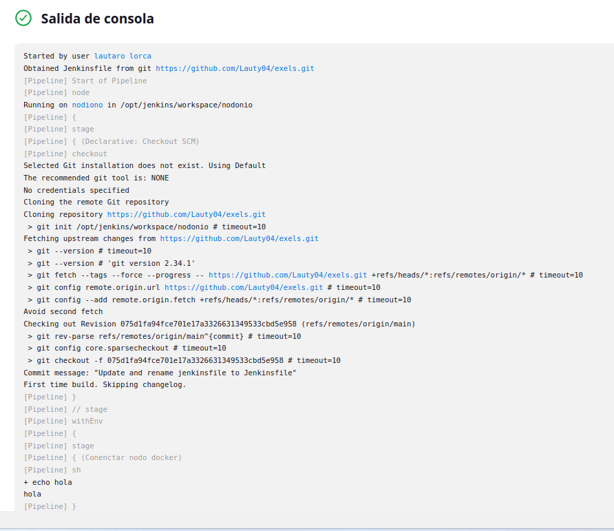

# Tarea Final

### Automatiza el siguiente proceso utilizando un pipeline de Jenkins ejecutado en un nodo externo (AWS o docker local)

1. En un repositorio creado por vosotros encontramos un fichero excel con usuarios que debe ser descargado.

2. Se debe comparar línea a línea (script python) con la versión anterior del fichero que tendremos previamente guardada  y se almacenarán los cambios observados (registros nuevos, eliminados y modifcados) en un fichero temporal (o cualquier sistema de almacenamiento temporal) para poder utilizarlo en el siguiente paso. Notificar por Telegram al administrador si ha ido bien este paso.

3. Se debe ejecutar por ssh en un servidor (o máquina conocida diferente al nodo donde se ejecuta el pipeline) un/s script/s para la inserción/modificación/eliminación de los usuarios. Notificar por Telegram al administrador si ha ido bien este paso.

4. En paralelo:
    1. Crear un informe a partir de una plantilla en Markdown en el que se reflejarán los cambios realizados (usuarios insertados / eliminados / modificados). 
    2. Push al github añadiendo el informe a una carpeta de informes del repositorio

5. Notificaciones:
    - Si todo ha ido bien se envía un correo electrónico (con el servidor que os habéis montado en otro módulo del ciclo) al administrador con el pdf del informe Markdown (utilizar Pandoc)
    - Si el proceso ha fallado se debe enviar una notificación al administrador con el log de la ejecución.

6. Bola Extra: Notificaciones a los usuarios por correo electrónico:
    - Usuarios añadidos: "Usuario añadido al sistema! Tus credenciales de acceso son: ...."
    - Usuarios eliminados: "Se ha dado de baja del sistema"
    - Usuarios modificados: "Su perfil ha sido actualizado"

---
---

### Como primer paso creamos un repositorio y subimos los 2 exels:

### El segundo paso es crear una nueva tarea que sea un Pipeline Script for SCM con git:

Ejecutamos y vemos que descarga el repositorio de git en el nodo nodiono.

Y este es el contenido que tenemos en github:

Ahora debemos crear otro nodo para hacer la ejecución del script en los que debemos abrir el puerto 22, instalar curl,java,git y por supuesto ssh.

Para que nos funcione el ssh tuvimos que crear otro usuario.

    docker run -it -p 2224:22 --name nodo2 ubuntu
    docker run -it -p 2223:22 --name nodo1 ubuntu

En el docker nodo1 donde se ejecutara el pipline se debe instalar tanto python como una libreria que usaremos:

    apt install python3-openpyxl

Ahora hicimos el pipline que debe descargar de github el repositorio,ejecutar el meta script de pyhton que generara un .sh y un .md a partir de la comparación de 2 excels con usuarios y luego enviar el .sh al nodo2 para que se ejecute en el y día a día haga una actulizacion de los usuarios en local, a parte de esto enviamos los logs en pdf a traves de telegram y los subimos a github para tener una documentaación diaría de los cambios.

Para poder ejecutar este script primero deberemos crear manualmente los usuarios con sus respectivos campos para que no falle el script, dejo tanto el pipeline como el script en el link:

    https://github.com/Lauty04/exels/tree/main

Los pasos o stages que tenemos en el jenkinsfile son:

Download and execute the script in nodo1 - Donde bajamos de github el repositorio,damos permisos al script en python y lo ejecutamos.

Send and execute the script in nodo2- Mandamos el script sh resultante del py al segundo nodo y lo ejecutamos.

Convert MD to PDF - Donde nos encargamos de convertir nustro markdown creado por el script en python a un pdf para terlo documentado tanto en markdown como en pdf.

Push to GitHub - Donde cojemos el archivo de registros o ejecuciones en md y pdf y lo subimos a github para que quede documentado.

Send logs.pdf by telegram- Enviamos los logs en pdf al bot de telegram.

Telegram message - Que se encarga de enviar un mensaje de ejecución positiva en caso de haberse completado la ejecución.

Vemos que todo se ejecutan perfectamente todos los stages:

Vemos en el workspace del job que los archivos que se debian crear a traves del script se generaron:

